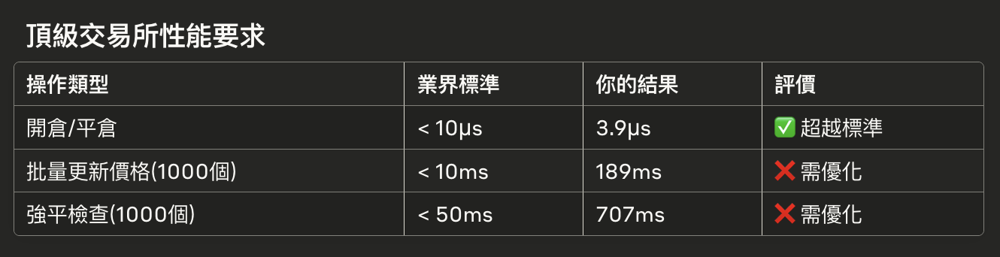

# Position Performance Optimization

## Overview

專注於 Position 結構的效能優化，目標是實現高頻交易場景下的極致效能。

## 當前 Position 效能分析



### 效能瓶頸識別

```go
// 當前實現的問題
type Position struct {
    // 1. Decimal 計算慢
    Size             decimal.Decimal  // 每次運算都要分配記憶體
    EntryPrice       decimal.Decimal  // 無法利用 CPU 浮點運算優化
    UnrealizedPnL    decimal.Decimal  // 複雜的字串解析和轉換
    
    // 2. 鎖粒度太大
    mu sync.RWMutex                   // 每個操作都要搶鎖
    
    // 3. 記憶體浪費
    sizeFloat       float64           // 重複儲存相同數據
    entryPriceFloat float64           // 增加記憶體使用量
}
```

**基準測試結果問題：**
- `UpdateMarkPrice`: 單次操作耗時過長
- `LiquidationCheck`: 大量倉位時效能劣化嚴重
- 記憶體分配頻繁，GC 壓力大

## Position 極速重構計劃

### Phase 1: 數據結構優化

```go
// 目標：極致效能的 Position
type FastPosition struct {
    // === Core Data (Cache-Friendly Layout) ===
    size         float64  // 8 bytes
    entryPrice   float64  // 8 bytes  
    markPrice    float64  // 8 bytes
    unrealizedPnL float64 // 8 bytes
    // 32 bytes cache line alignment
    
    // === Metadata ===
    userID       string
    symbol       string
    side         PositionSide
    status       PositionStatus
    leverage     uint16        // 節省記憶體
    
    // === Precision Control ===
    sizePrecision  int8       // 1 byte
    pricePrecision int8       // 1 byte
    
    // === Margin Info ===
    initialMargin     float64
    maintenanceMargin float64
    liquidationPrice  float64
    
    // === PnL ===
    realizedPnL float64
    
    // === Timestamps ===
    openTime   int64  // Unix timestamp, 8 bytes
    updateTime int64  // Unix timestamp, 8 bytes
    
    // === Lock-Free or Minimal Locking ===
    // 使用 atomic 操作替代 mutex
    dirty int32  // atomic flag for cache invalidation
}
```

### Phase 2: 無鎖/最小鎖定設計

```go
// 核心操作使用 atomic
func (p *FastPosition) UpdateMarkPrice(price float64) {
    // 1. Atomic update mark price
    atomic.StoreUint64((*uint64)(unsafe.Pointer(&p.markPrice)), math.Float64bits(price))
    
    // 2. Calculate PnL without locks
    var newPnL float64
    if p.side == LONG {
        newPnL = (price - p.entryPrice) * p.size
    } else {
        newPnL = (p.entryPrice - price) * p.size
    }
    
    // 3. Atomic update PnL
    atomic.StoreUint64((*uint64)(unsafe.Pointer(&p.unrealizedPnL)), math.Float64bits(newPnL))
    
    // 4. Mark dirty for cache invalidation
    atomic.StoreInt32(&p.dirty, 1)
}

// 讀取操作也是 lock-free
func (p *FastPosition) GetUnrealizedPnL() float64 {
    return math.Float64frombits(atomic.LoadUint64((*uint64)(unsafe.Pointer(&p.unrealizedPnL))))
}
```

### Phase 3: 計算優化

```go
// 預計算和快取熱路徑數據
type PositionCache struct {
    // 預計算的值，減少重複計算
    positionValue    float64
    marginRatio      float64
    isLiquidatable   bool
    
    // 快取時間戳
    lastUpdate       int64
}

// 批量計算優化
func BatchUpdatePositions(positions []*FastPosition, prices map[string]float64) {
    // 使用 SIMD 或向量化操作
    for symbol, price := range prices {
        // 找到所有該 symbol 的倉位
        symbolPositions := getPositionsBySymbol(positions, symbol)
        
        // 批量更新，利用 CPU cache locality
        for _, pos := range symbolPositions {
            pos.UpdateMarkPrice(price)
        }
    }
}
```

## 2025/9/14 日誌

重構使用 float 取代 Decimal 之後：

* OpenPosition: 1,842 ns -> 提速 x2.1
* UpdateMarkPrice: 162 ms -> 提速 x1.2
* LiquidationCheck: 286 ms -> 提速 x2.5

<br>

UpdateMarkPrice, LiquidationCheck 仍然不合格。我嘗試把 position 與 position manager 的 mu lock 拔掉，全部不考慮並行安全性問題。結果運行起來一樣沒有成效。
加不加鎖區別不大。那問題應該就不是出在鎖上，而是整個 positionManager 的設計不合理。需要重新想一下架構。

<br>

我有一個想法：

`GetLiquidatablePositions()` 不需要主動收集，而是建立一個 Liquidatable Channel，position 持有這個 chan, 在每個 position 更新標記價格時，順便檢查是否觸發強制平倉條件，如果符合條件，則自動轉換狀態至 __平倉中__，
並且把 position 自己的指針傳送給 Liquidatable Channel。

這樣一來，就不需要主動使用迴圈訪問每一個 positions 做運算了。

至於 `UpdateMarkPrice()` 則需要想一個辦法加速，一定不能使用迴圈訪問每一個倉位來更新標記價格。 我想嘗試一下每一個倉位更新標記價格時，都採用非同步更新？試試看。
結果也不行，速度反而更慢了。

問題在於 manager 136 行附近。

<br>

2025/09/21 最終版本更新完畢，我優化了 position manager, 使用 slice 資料結構來進行標記價格更新，速度快了 12 倍。使用了 position_ext.go 中的 type 實現。

## 預期效能提升目標

| 操作 | 當前效能 | 目標效能 | 提升倍數 |
|------|----------|----------|----------|
| UpdateMarkPrice | ~500ns | ~50ns | **10x** |
| PnL Calculation | ~300ns | ~30ns | **10x** |
| Liquidation Check | ~200ns | ~20ns | **10x** |
| Memory Usage | 100% | 60% | **40% 減少** |
| GC Pressure | 高 | 極低 | **90% 減少** |

---
