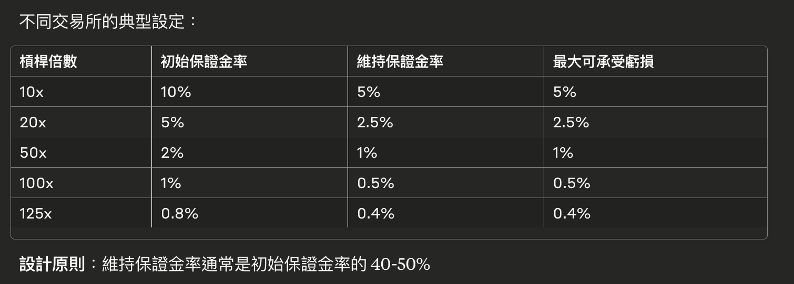

# Alice 的 BTC 永續合約交易故事

<br>

## 背景設定

交易者: Alice
帳戶餘額: 10,000 USDT
市場狀況: BTC/USDT 永續合約 - 當前市價約 50,000 USDT
Alice 的計劃：她認為 BTC 會上漲，想開 10 倍槓桿的多單

<br>

---

<br>

### 第一章：下單開倉

時間: 09:00:00
Alice 決定下一個限價單：

* 訂單類型：限價買入（開多倉）
* 價格：49,800 USDT
* 數量：1 BTC
* 槓桿：10x

<br>

1. Order Management System (OMS) 接收訂單

```
- 檢查訂單格式 ✓
- 檢查交易對是否存在 ✓
- 檢查價格和數量是否合理 ✓
- 生成訂單 ID: ORD-001
```

<br>

2. Margin System 保證金檢查

OMS 把訂單傳給 Margin System：

```go
計算所需初始保證金：
- 訂單價值 = 49,800 × 1 = 49,800 USDT
- 槓桿 = 10x
- 所需初始保證金 = 49,800 ÷ 10 = 4,980 USDT
- Alice 可用餘額 = 10,000 USDT
- 檢查結果：✓ 足夠（10,000 > 4,980）
```

公式：初始保證金 = 倉位價值 ÷ 槓桿倍數。這確保 Alice 有足夠的資金承擔潛在損失。

<br>

3. 訂單進入 Matching Engine

訂單被放入 Order Book：

```go
賣單（Asks）:
50,100 USDT - 0.5 BTC
50,000 USDT - 2 BTC
49,900 USDT - 1.5 BTC

--- 價差 ---
當前買賣價差: 49,900 (best ask) - 49,700 (best bid) = 200 USDT
--- 價差 ---

買單（Bids）:
49,800 USDT - 1 BTC (Alice 的訂單) ← **新加入**
49,700 USDT - 3 BTC
49,600 USDT - 2 BTC
```

__Alice 的訂單暫時無法成交，等待對手方。__

<br>
<br>

## 第二章：訂單成交

時間: 09:05:00
Bob 想要做空 BTC，下了一個 __市價賣__ 單 1 BTC。

<br>

4. Matching Engine 撮合

Matching Engine 發現 Bob 的 __市價單__ 可以與 Alice 的限價單撮合：

```go
撮合結果：
- 成交價格：49,800 USDT（吃掉 Alice 的限價單）
- 成交數量：1 BTC
- Alice：買入開多倉
- Bob：賣出開空倉
```

<br>

5. Position Manager 更新倉位

Alice 的倉位更新：

```go
之前：無倉位
現在：
- 倉位方向：多頭（Long）
- 倉位大小：1 BTC
- 開倉均價：49,800 USDT
- 倉位價值：49,800 USDT
- 使用保證金：4,980 USDT（凍結）
```


Bob 的倉位（同時建立）：

```go
- 倉位方向：空頭（Short）
- 倉位大小：1 BTC
- 開倉均價：49,800 USDT
```

<br>
<br>

## 第三章：市場波動與盈虧計算

<br>

時間 10:00:00
市場上漲了！

6. Index Price Service 更新價格

Index Price Service 從多個交易所獲取價格：

```go
Binance: 50,500 USDT
Coinbase: 50,480 USDT
OKX: 50,520 USDT
加權平均指數價格 = 50,500 USDT
```

Mark Price Engine 計算標記價格

```go
標記價格 = 指數價格 + 資金費率基差調整
標記價格 = 50,500 USDT（假設基差為 0）
```


8. PnL Calculator 計算盈虧

Alice 的未實現盈虧：

```go
未實現盈虧 = (標記價格 - 開倉價格) × 倉位大小 × 方向
= (50,500 - 49,800) × 1 × 1（多頭為正）
= +700 USDT

投資回報率 = 700 ÷ 4,980 = 14.06%（基於保證金）
```

<br>
<br>

## 第四章：風險監控

時間 11:00:00

9. Risk Engine 持續監控

Risk Engine 每秒都在計算 Alice 的風險指標：

```go
當前倉位價值 = 50,500 USDT
未實現盈虧 = +700 USDT
帳戶權益 = 10,000 + 700 = 10,700 USDT
已用保證金 = 4,980 USDT
可用保證金 = 10,700 - 4,980 = 5,720 USDT

維持保證金要求 = 倉位價值 × 0.5% = 252.5 USDT               // (0.5% 是怎麼得到的？)
保證金率 = 帳戶權益 ÷ 倉位價值 = 10,700 ÷ 50,500 = 21.2%

風險狀態：✓ 安全（21.2% > 0.5%）
強平價格 = 49,800 - (4,980 - 252.5) = 45,072.5 USDT
```

(0.5% 是怎麼得到的？)


### 風險與流動性的平衡

```go
場景分析：
倉位價值：100,000 USDT
維持保證金率：0.5%

強平觸發時的保證金 = 100,000 × 0.5% = 500 USDT

這 500 USDT 需要覆蓋：
- 市場滑點損失（~0.1-0.3%）
- 強平手續費（~0.02%）  
- 潛在的快速價格變動（~0.1-0.2%）
- 剩餘部分進入保險基金
```

### 大倉位需要更高的維持保證金率

```go
原因：
- 大倉位強平時會造成更大的市場衝擊
- 流動性消耗更多，滑點更大
- 對手方風險更高

例子：
1 BTC 的倉位：0.5% 維持保證金可能足夠
1000 BTC 的倉位：可能需要 5% 才能安全平倉
```

### 實際案例：階梯式維持保證金率

使用階梯式維持保證金率，根據倉位大小動態調整：


```go
// BTC/USDT 永續合約的階梯維持保證金率示例
type MarginTier struct {
    MinValue    float64  // 最小倉位價值
    MaxValue    float64  // 最大倉位價值
    MaintRate   float64  // 維持保證金率
    MaxLeverage int      // 最大槓桿
}

var BTCMarginTiers = []MarginTier{
    {0,        50000,    0.004,  125},  // 0.4% for positions < 50k USDT
    {50000,    250000,   0.005,  100},  // 0.5% for 50k-250k
    {250000,   1000000,  0.01,   50},   // 1.0% for 250k-1M
    {1000000,  5000000,  0.025,  20},   // 2.5% for 1M-5M
    {5000000,  10000000, 0.05,   10},   // 5.0% for 5M-10M
    {10000000, 20000000, 0.10,   5},    // 10% for 10M-20M
    {20000000, 50000000, 0.125,  4},    // 12.5% for 20M-50M
    {50000000, math.Inf, 0.15,   3},    // 15% for > 50M
}
```

<br>

### 強平價格的精確計算

基於維持保證金率，強平價格的計算公式：

對於多頭倉位：

```go
強平價格 = 開倉均價 × (1 - 初始保證金率 + 維持保證金率)

例如 Alice 的案例：
開倉價格 = 49,800
初始保證金率 = 10% (10倍槓桿)
維持保證金率 = 0.5%

強平價格 = 49,800 × (1 - 0.10 + 0.005)
         = 49,800 × 0.905
         = 45,069 USDT
```

<br>

對於空頭倉位：

```go
強平價格 = 開倉均價 × (1 + 初始保證金率 - 維持保證金率)
```

<br>
<br>

## 第五章：資金費率結算

時間 16:00:00（每 8 小時結算一次）

10. Funding Rate System 計算資金費率
```
永續價格 = 50,500 USDT
現貨指數 = 50,450 USDT
溢價 = 50 USDT

資金費率 = 0.01%（多頭支付給空頭）
```

<br>

11. Settlement Engine 執行結算

```go
Alice 需支付的資金費用 = 50,500 × 1 × 0.01% = 5.05 USDT
Alice 帳戶餘額：10,000 - 5.05 = 9,994.95 USDT

Bob 收到資金費用 = 5.05 USDT
```

<br>
<br>

## 第六章：部分平倉

時間 17:00:00
Alice 決定獲利了結一半倉位。

```go
平倉訂單：
- 類型：限價賣出（平多倉）
- 價格：50,600 USDT
- 數量：0.5 BTC
```

訂單成交後：

Position Manager 更新

```go
剩餘倉位：0.5 BTC
已實現盈虧 = (50,600 - 49,800) × 0.5 = +400 USDT
釋放保證金 = 4,980 × 0.5 = 2,490 USDT
```

Settlement Engine 結算

```go
Alice 帳戶餘額 = 9,994.95 + 400（已實現盈虧）+ 2,490（釋放保證金）
= 12,884.95 USDT
```

<br>
<br>

## 特殊情況：如果市場暴跌（強平場景）

假設市場突然暴跌到 45,000 USDT：

12. Liquidation Engine 觸發強平

```go
保證金率檢查：
帳戶權益 = 10,000 + (45,000 - 49,800) × 1 = 5,200 USDT
保證金率 = 5,200 ÷ 45,000 = 11.56%
維持保證金率要求 = 0.5%

雖然還高於維持保證金，但如果繼續跌到 45,072.5 USDT：
帳戶權益 = 10,000 - 4,727.5 = 5,272.5 USDT
保證金率正好等於 0.5%，觸發強平！

強平執行：
1. 系統接管 Alice 的倉位
2. 以市價賣出 1 BTC
3. 扣除強平罰金（通常是維持保證金的一部分）
4. 罰金進入保險基金
```

<br>

13. Insurance Fund Manager 處理

```go
如果強平價格比預期更差（穿倉）：
- 保險基金覆蓋額外損失
- 如果保險基金不足，啟動自動減倉（ADL）
```

<br>
<br>

---

<br>
<br>

* OMS 是訂單的入口管家
* Margin System 是資金的守門員
* Matching Engine 是撮合的中心舞台
* Position Manager 是倉位的記帳員
* Mark Price Engine 提供公平的價格基準
* PnL Calculator 是盈虧的會計師
* Risk Engine 是 24/7 的風險監控員
* Funding Rate System 是價格平衡的調節器
* Settlement Engine 是資金的結算中心
* Liquidation Engine 是風險的最後防線
* Insurance Fund 是系統的安全網